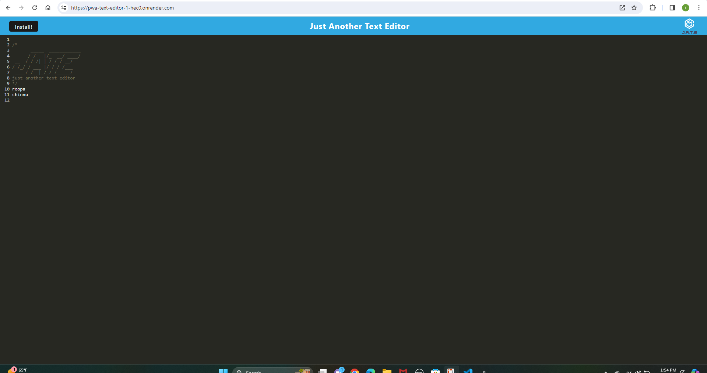
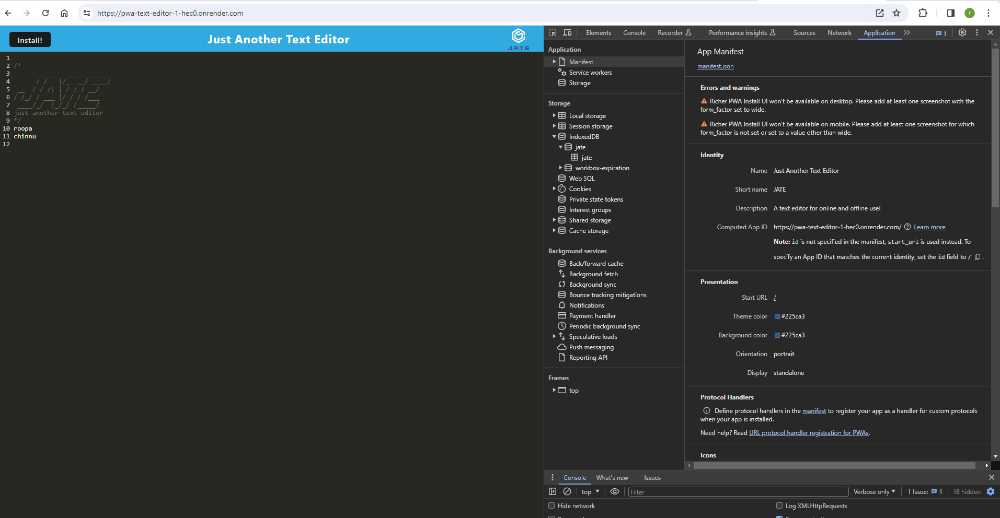
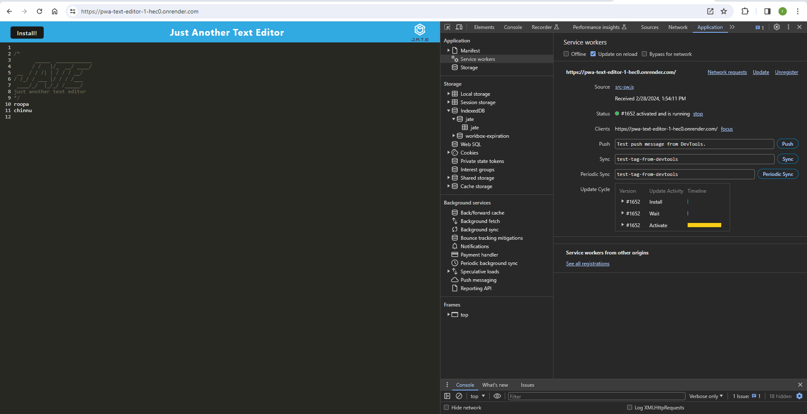
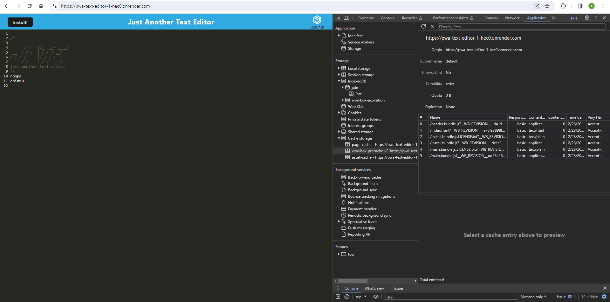

# Description

The application is a web text editor where the user can create notes or code snippets with or without an internet connection and where the user can reliably retrieve them for later use. The integrated service worker and Cache API's ensure that the application will remain fully functional even without and active internet connection. This application allows the user to access visited pages even if the application is offline.

# Usage

Visit the deployed site below. When you enter text it will save automatically when you click off of the window. If you refresh or revist the text will remain. If you go offline it will store your changes until you are back online. It is downloadable as a seperate app.

# Installation

This program has has dependencies, and requires their installation via npm. This project has both a server and a client component, with the client component requiring a build. This can all be invoked via Node at the command prompt using npm run start:dev.

# Screenshots

[Deployed url on Render](https://pwa-text-editor-1-hec0.onrender.com/)

[Github url](https://github.com/RoopaThimmanacherla/pwa-text-editor)

